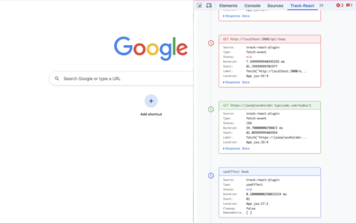

# track-react


A comprehensive React development tool that provides real-time monitoring and debugging capabilities for React applications. Track-react consists of a Vite plugin for code transformation and a browser extension for visualization, helping developers understand their application's behavior during development.

## 🚀 Features

- **Fetch Request Tracking**: Monitor all fetch requests with detailed timing, status, and response data
- **Async/Await Monitoring**: Track async operations and their performance
- **useEffect Hook Analysis**: Monitor useEffect calls, dependencies, and cleanup functions
- **Real-time Timeline**: Visual timeline of all tracked events in your React application
- **Browser Extension**: Dedicated DevTools panel for debugging
- **Zero Configuration**: Works out of the box with minimal setup

## 📦 Installation

### As a Development Dependency

```bash
npm install track-react --save-dev
```

### Browser Extension

The Track-React extension can be downloaded from the Chrome Web Store.

Optionally the extension can also be added with the `npm run build` command by following these steps:

1. Fork and clone the `track-react` repo
2. Build the extension from the `dist` folder after running the development server — see "Building the Extension" below
3. Load the extension in Chrome Developer Mode
4. The track-react panel will appear in Chrome DevTools

### Chrome Devtools Panel



## ⚙️ Setup

### 1. Vite Plugin Configuration

Add the track-react plugin to your `vite.config.ts`:

```typescript
import { defineConfig } from 'vite';
import react from '@vitejs/plugin-react';
import trackReactPlugin from 'track-react';

export default defineConfig({
  plugins: [
    react(),
    trackReactPlugin(), // Add the track-react plugin
  ],
});
```

### 2. Browser Extension Setup

1. Run your development server
2. Open Chrome DevTools
3. Navigate to the "track-react" panel
4. Start monitoring your React application's behavior

## 🔧 How It Works

### Runtime Model & Packaging

- Running `npm install track-react --save-dev` installs **only the published Vite plugin package** (from this repo’s `vite-plugin/`), not the entire repository and **not** the Chrome DevTools extension UI.
- The npm package ships the **compiled build from `vite-plugin/dist/`** plus lightweight **runtime helpers** from `vite-plugin/runtime/`. These are the only files included via the package’s `"files"` field and surfaced through its `"exports"` map.
- What you add to your app is a **front-end–only** development tool: the Vite plugin + Babel transforms and the async event-tracking runtime (`fetch`, `async/await`, `useEffect`). Tracked events are forwarded to the Track-React DevTools panel when the extension is installed.
- There is **no backend** component. You **do not** need to run any additional servers during development—just run your app and open the Track-React panel in DevTools.
- Keep it as a **dev dependency** and enable `trackReactPlugin()` in your Vite config. The plugin declares `vite` as a peer dependency.

### Code Transformation

Track-react uses Babel plugins to transform your code during development:

#### Fetch Requests

```javascript
// Original code
fetch('/api/users');

// Transformed code
retrieveFetchData('/api/users', 'file.js:10');
```

#### Async/Await Operations

```javascript
// Original code
const result = await someAsyncFunction();

// Transformed code
const result = await retrieveAwaitData(someAsyncFunction(), 'file.js:15');
```

#### useEffect Hooks

```javascript
// Original code
useEffect(() => {
  // effect logic
}, [dependency]);

// Transformed code
retrieveUseEffectData(
  () => {
    // effect logic
  },
  [dependency],
  'file.js:20'
);
```

### Data Collection

The plugin collects comprehensive metadata for each tracked operation:

- **Timing Information**: Start time, duration, performance metrics
- **Request Details**: HTTP method, URL, status codes, response data
- **Hook Information**: Dependencies, cleanup functions, effect lifecycle
- **Source Location**: File names and line numbers for easy debugging

## 📊 Timeline Visualization

The browser extension provides a rich timeline view showing:

- **Color-coded Events**: Green for successful operations, red for errors, blue for React hooks
- **Detailed Metadata**: Expandable panels with full request/response data
- **Performance Metrics**: Timing information for all tracked operations
- **Source Mapping**: Direct links to source code locations

## 🛠️ Development

### Project Structure

```
track-react/
├── vite-plugin/                 # Vite plugin source
│   ├── src/
│   │   ├── index.ts            # Main plugin entry
│   │   ├── fetchPlugin.ts      # Fetch request transformation
│   │   ├── awaitPlugin.ts      # Async/await transformation
│   │   └── useEffectPlugin.ts  # useEffect transformation
│   ├── runtime/                # Runtime helpers
│   │   ├── retrieveFetchData.ts
│   │   ├── retrieveAwaitData.ts
│   │   └── retrieveUseEffectData.ts
│   └── babel-plugins/          # Babel transformation plugins
├── devtools/                   # Browser extension
│   ├── manifest.json
│   ├── devtools.html
│   ├── devtools.js
│   ├── content.js
│   └── background.js
├── client/                     # Extension UI
│   ├── components/
│   │   └── Timeline.tsx        # Main timeline component
│   ├── App.tsx
│   └── main.tsx
└── dist/                       # Built extension files
```

### Building the Plugin

```bash
cd vite-plugin
npm run build
```

### Building the Extension

```bash
npm run dev    # Start development server
npm run build  # Build for production
```

### Development Setup

1. Clone the repository
2. Install dependencies: `npm install`
3. Build the plugin: `cd vite-plugin && npm run build`
4. Start the development server: `npm run dev`
5. Load the extension in Chrome from the `dist` folder

## 🎯 Use Cases

### Performance Debugging

- Identify slow API requests
- Monitor async operation timing
- Track useEffect re-renders and dependencies

### Development Workflow

- Visualize data flow in your application
- Debug race conditions in async code
- Monitor component lifecycle events

### Testing and QA

- Verify API integrations
- Ensure proper error handling
- Validate component behavior

## ⚠️ Important Notes

- **Development Only**: This tool is designed for development environments only
- **Performance Impact**: Minimal overhead during development, but should not be used in production
- **Browser Compatibility**: Currently supports Chrome-based browsers
- **React Version**: Compatible with React 16.8+ (hooks required)

## 🔧 Configuration Options

The plugin accepts optional configuration:

```typescript
trackReactPlugin({
  // Configuration options (if any)
});
```

## 🐛 Troubleshooting

### Plugin Not Working

- Ensure the plugin is added to your Vite config
- Check that you're running in development mode (`npm run dev`)
- Verify the browser extension is loaded and active

### No Data in Timeline

- Check browser console for errors
- Ensure the DevTools panel is open
- Verify that your code contains trackable operations (fetch, await, useEffect)

### Build Issues

- Ensure all dependencies are installed
- Check that TypeScript compilation is successful
- Verify Vite configuration is correct

## 📄 License

This project is licensed under the MIT License.

## 🤝 Contributing

Contributions are welcome! Please feel free to submit a Pull Request.

## 📞 Support

For issues and questions, please open an issue on the GitHub repository.

---

Built with ❤️ for the React development community
We love you
